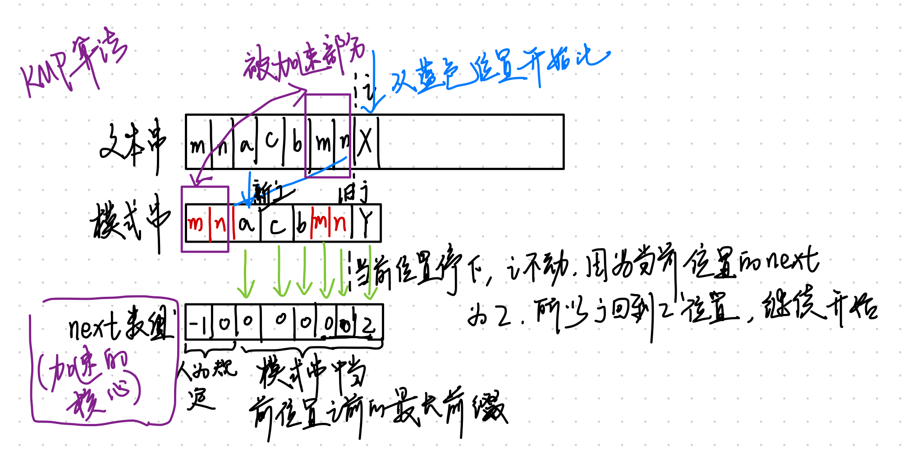

# 数据结构和算法从入门到放弃（java详细注释版）

（每日更新中...欢迎指正）

## 文件夹说明：

- test文件夹为练习算法使用
- 其余文件夹按照分类存放，常见问题以及对应的注意事项都在注释中

## code01 排序

| 题目                                                         | 思路                                                         | 易错点                                                       | 稳定性 | 大O   | 原地排序 |
| ------------------------------------------------------------ | ------------------------------------------------------------ | ------------------------------------------------------------ | ------ | ----- | -------- |
| [选择排序](./src/com/deltaqin/code01_sort/S01_SelectionSort.java) | 未处理中选择最小的和当前 i 替换                              | 加入内层循环的时候设置初始index应该是未排好序的起始位置，<br />外层循环的范围是数组长度-1，内层循环的范围应该是所有数组长度 | 不稳定 | n^2   | 是       |
| [冒泡排序](./src/com/deltaqin/code01_sort/S02_BubbleSort.java) | 外层从右向左，内层从左向右，符合条件就交换                   | 外循环 i 的初始值定义为数组长度-1。因为索引的下标是0开始.<br />注意是谁和谁交换，是 j 和 j+1 | 稳定   | n^2   | 是       |
| **[插入排序（重要）](./src/com/deltaqin/code01_sort/S03_InsertionSort.java)** | 外层从左到右，内层从右到左，比自己大就交换，否则结束内循环   | 边界，外层要走到最后，所以范围是arr.length，内层最后一个也要比较，也是arr.length<br /> | 稳定   | n^2   | 是       |
| [归并排序](./src/com/deltaqin/code01_sort/S04_MergeSort.java) | merge是入口函数，mergSort是分治递归函数（左半边和右半边的两个数组有序，arr,l,r），mergeTwo是合并两个有序数组(arr,l,mid,r)<br />注意函数的参数都是要处理数组的闭区间 | 左闭右闭区间方便处理`[l,mid][mid+1,r]`<br />合并两个数组的时候容易漏掉最后一位，注意是闭区间<br />递归函数的结束条件是l==r，不是数组长度为1，递归的时候数组是不变的，变的是 l 和 r<br />mergSort里面最后转移回来的时候长度应该是help的长度 | 稳定   | Nlogn | 否       |
| [堆排序](./src/com/deltaqin/code01_sort/S05_HeapSort.java)   | 先一个一个插入构造大堆，弹出一个和结尾交换，堆-1，直到堆的大小是0就从小到大排好序<br />heapSort是入口函数，负责构造大堆以及循环从堆顶交换数据到数组非堆部分首部<br />insertHeap构造堆函数<br />heapify是将当前节点下沉到合适位置 | 插入构造大堆的时候是有序的，所以层数越往上，数值越大         |        |       |          |
| [快速排序](./src/com/deltaqin/code01_sort/S06_QuickSort.java) | 分区，小的分在左边，大的分在右边，之后递归调用左右，返回左右都有序的<br />quickSort入口函数调用递归函数，process是给定数组l和r输出有序的数组，内部调用分区函数分为左右两块，两块分别调用递归函数 | 左闭右闭区间方便处理`[l,mid][mid+1,r]`<br />左右分区的时候都从数组外侧开始，属于左侧就和左侧外部第一个交换，属于右侧就和右侧外部第一个交换，属于左侧 step 需要前进，属于右侧不可以前进，因为不知道换回来是什么样的，等于pivot就不操作，直接增加step<br />basecase不可以写左边界等于右边界，而是>= | 不稳定 | Nlogn |          |
| [三路快速排序](./src/com/deltaqin/code01_sort/S02_BubbleSort.java) |                                                              |                                                              |        |       |          |
| [计数排序](./src/com/deltaqin/code01_sort/S02_BubbleSort.java) |                                                              |                                                              |        |       |          |
|                                                              |                                                              |                                                              |        |       |          |
| [基数排序](./src/com/deltaqin/code01_sort/S02_BubbleSort.java) |                                                              |                                                              |        |       |          |
| [希尔排序](./src/com/deltaqin/code01_sort/S02_BubbleSort.java) |                                                              |                                                              |        |       |          |

## code02 二分查找

| 题目                                       | 思路 | 易错点 |
| ------------------------------------------ | ---- | ------ |
| 有序数组的二分查找                         |      |        |
| 有序数组的左边界查找                       |      |        |
| 局部最小值查找                             |      |        |
| 山峰数组中值的查找：主要涉及向上取整的问题 |      |        |
|                                            |      |        |
|                                            |      |        |

## code03 链表

### 思路总结

| 题目                                                         | 思路                                                         | 易错点                                                       |
| ------------------------------------------------------------ | ------------------------------------------------------------ | ------------------------------------------------------------ |
| [反转链表](./src/com/deltaqin/code03_linked_list/L01_ReverseList.java) | 单向链表：先将next存起来，head指向自己的前面pre，然后head自己变成pre，然后next变成head<br />next = head.next; head.next = pre; pre = head; head = next; | 四个的顺序，<br />head == null是结束条件                     |
|                                                              | 递归单向链表：<br />首先是递归后序遍历链表的思路，自己先到达链表的尾部，也就是递归底部，开始让自己的下一个指向自己，自己指向null，每次自己的指向有自己前面的负责更新，这样最后第一个节点设置null之后没人给他更新，就是真的null了 | 返回值就是递归函数的返回值last，一直都是最后那个节点         |
|                                                              | 反转双向链表：<br />只需要在next指向自己前一个节点的时候，加一个pre指向自己后一个节点即可 | 返回值是head不是pre，因为循环的结束条件是pre==null           |
| 反转链表的前N项                                              | 递归，后序。一开始先记录head的后继节点，注意递归的全反转是不需要记录自己的下一个节点是谁的。递归函数的作用是用自己的下一个节点，反转前n-1个节点。返回链表的头部。<br />自己的下一个节点指向自己，自己指向一开始存的后继，因为不是全部反转，所以最后一个应该指向没有反转的开头而不是null | 注意递归函数的参数定义。一个是等待反转的头节点，一个是反转的链表的个数<br />递归的结束条件是n==1,并且最后一个返回自己还要记录后驱节点<br />后驱节点不可以写在函数递归栈里面 |
| [打印公共子串](./src/com/deltaqin/code01_sort/S02_BubbleSort.java) |                                                              |                                                              |
| [回文判断](./src/com/deltaqin/code01_sort/S02_BubbleSort.java) |                                                              |                                                              |
| 给定pivot划分为左中右三部分                                  |                                                              |                                                              |
| 复制有随机指针的链表（random指针可以是null）                 |                                                              |                                                              |
| 找（有无环）链表的交点                                       |                                                              |                                                              |
| 实现一个队列                                                 |                                                              |                                                              |
| 实现一个栈                                                   |                                                              |                                                              |
| 用栈实现一个队列                                             |                                                              |                                                              |

### 单向，双向链表节点定义

```java
public class Demo{
  
  public static class Node{
    public int val; 
    public Node next;
    public Node(int val) {
    	this.val = val;
    }
  }
  
  public static class DoubleNode{
    public int val;
    public DoubleNode pre;
    public DoubleNode next;
    public DoubleNode (int val){
      this.val = val;
    }
  }
}
```


### 反转单向链表

非递归：

```java
public static Node reverse(Node head) {
  Node pre = null;
  Node next = null;
  while(head != null) {
    next = head.next;
    head.next = pre;
    pre = head;
    head = next;
  }
  // 注意返回的pre一定有值而且是最后一个
  return pre;
}
```

递归：

相当于在链表的后序遍历上操作，所以递归从底向上的时候就从后往前走的过程，结束条件是到达链表最后一个节点，返回自己作为last节点。

node 的下一个节点指向自己，自己的下一个节点指向null；返回的是最后一个节点last。

```java
public static Node reverse(Noode head) {
  if(head == null || head.next == null ){
    return head;
  }
  Node last = reverse(head.next);
  node.next.next = node;
  node.next = null;
  return last;
}
```

### 反转双向链表

在自己的next指向自己的上一个的时候，把自己的pre指向自己的下一个就好，比起单向多了一句话

```java
public static Node reverse(Node head) {
  Node pre = null ;
  Node next = null;
  
  while(head != null) {
    next = head.next;
    head.next = pre;
    // 多这一句
    head.pre = next;
    pre = head;
    head = next;
  }
  // 老是忘记返回，人没了
  return pre;
}
```

### 反转链表的前N项

递归，后序遍历，注意自己最后不是null，而是不反转的开头节点。

递归的结束条件是当前需要反转的节点就剩下一个了。

```java
// 保存不反转的 前缀
Node successor = null;

// 给定要反转 n 个节点，返回反转完的头节点
public static Node reverseN(Node head, int n) {
  // 结束条件是反转到最后，不是为null
  if (n == 1) {
    successor = head.next;
    return head;
  }
  
  Node last = reverseN(head.next, n-1);
  head.next.next = head;
  // 为了和不反转的开头相连
  head.next = successor;
  return last;
}
```

### 反转链表的一部分

这个需要和前面的反转链表的前N项结合。反转完之后后面是接住的，只要手动把前面接一下就好了

```java
public static reverseBetween(Node head, int m, int n) {
  if(m == 1) {
   	// 直接调用反转自己的前n项
    reverseN(head, n);
  }
  
  // 注意要反转的链表的相对长度是没有变化的。都-1
  head.next = reverseBetween(head.next, m-1, n-1);
  return head;
}
```


## code04 树

| 题目                     | 思路                                                         | 易错点 |
| ------------------------ | ------------------------------------------------------------ | ------ |
| 深度遍历递归实现         | 对应位置做相关操作即可                                       |        |
| 深度遍历非递归           | 使用栈实现<br />先序遍历：先放root，再压入**右子节点，再压入左**子节点<br />中序遍历(**不熟练**)：**不断压入弹出每一个树的左边界**（当前弹出的节点有右节点，就将其左边界压入栈再弹出）(while条件中需要 |        |
| 广度优先遍历             | 使用队列（LinkedList有add和poll，注意不能使用List多态接收，poll方法只有LinkedList有）实现，弹出节点孩子不为空就加入，直到栈为空结束 |        |
| 获取树的最大宽度         | 首先使用队列实现宽度优先遍历，其次使用**map来保存每一个节点的层数，放入map的时候肯定是当前节点的下一层节点呀，这样当从队列取出来去map找，发现节点所在层数与当前正在遍历的层数不一致的时候，说明换行了**，就记录之前层的最大节点数，直到队列为空得到最大宽度。 |        |
| 获取树 的高度            | 使用map，保存节点的子节点所在的层（当前层+1），当发现取出来的节点的层数与当前层不一致就+1，**广度优先遍历**，结束就获得最大高度 <br /><br />不使用map：递归左子树和右子树的最大高度+1就是当前树的最大高度，也就是**后序遍历**，结束就获得最大高度 |        |
| 是否是二叉搜索树         | **中序遍历，结果是升序即可**：  <br />- 借助额外的队列使得中序遍历和大小比较分离， <br />- 不借助额外队列的话需要保证每次弹出的一个值大于自己之前弹出的一个值。 <br />- 不使用递归时候的中序遍历需要一个栈不断将最左边界压入，if 条件容易写错，弹出的值和当前的root容易混淆。 <br /><br />**后序遍历**，**保证左子树和右子树都是BST，且中间大于左子树的最大值，小于右子树的最小值**。而且当前树的最值是通过左树和右树的最值共同求出来的。递归函数的返回值需要自己封装，因为需要三个值（最大值，最小值，以及是否为子树） |        |
| 是否是完全二叉树         | 宽度优先遍历，当一个节点只有左孩子没有右孩子或者就没有左孩子也没有右孩子，他之后所有的节点都是叶子节点，否则不是CBT，有右孩子没有左孩子也不是BST |        |
| 是否是满二叉树           | 节点个数满足 2^n-1, n是层数，递归函数的返回值需要自己**封装节点的个数以及树的高度**。 |        |
| 是否是平衡二叉树         | **后序遍历**（明确AVL的三个条件：左子树和右子树都是AVL，而且两个的高度之差是小于2的，明确递归发生回溯DP的时候要和子树要什么信息）。递归函数的函数是返回当前树是不是AVL以及他的高度，所以返回值需要封装一下，计算返回值的时候使用两个子树的高度最大值+1，判断是否是AVL只需要看三个条件是否满足：左子树和右子树都是AVL。而且两个的高度之差是小于2的 |        |
| 找两个节点的最小公共祖先 | 方法一：空间占用大。使用map来存放树上所有节点的father，根节点father是自己。从o1（包括o1，循环结束的条件是自己的父亲是自己）开始向上找到自己的父亲放到set里面直到根节点，从o2开始向上找（包含o2），如果发现set里面有自己的父亲，就直接返回父亲就是最小公共祖先 <br /><br />方法二：空间占用小，难理解。  递归结束条件：如果当前节点是空的（叶子节点的子节点），或者是要找的o1或者o2，那就没有必要继续往下找了 <br />情况一（返回当前节点）：如果当前节点的左子树和右子树各自包含其中一个节点，那么当前节点就是最小公共父节点， <br />情况二（返回当前节点的子节点）：如果当前节点只有一个子节点包含要找的节点，就返回这个节点，可能当前子节点就是公共节点，也可能当前子节点是其中一个要找的节点 |        |
| 给定节点输出后继节点     | 如果当前节点有右子树，输出右子树的最左节点， 如果当前节点没有右子树，往上找自己的父亲节点，只要自己不是自己父亲节点的右孩子，输出父亲节点，如果直到根节点（父节点是null）都是自己父节点的右孩子，那自己就是最后一个节点，返回null |        |
| 序列化树和反序列化树     | 注意特殊字符不要是-，因为负数的时候回出问题，起不到分割的效果<br /><br />先序序列化：直接使用递归先序就可以，注意递归的结束条件，是为了解决每一个叶子节点 `if (root == null) return "#~";`<br /><br />先序反序列化：转换为char数组之后，使用队列将其存起来，一个个出来的时候还是中左右的顺序，还是先序递归恢复即可<br /><br />宽度优先序列化：中间空的节点使用特殊字符代替，恢复的时候遇到直接跳过<br /><br />宽度优先反序列化 |        |
| 微软折纸问题             | 转为树的中序遍历，根节点是凹，假设是false。这里没有现成的树，需要自己通过递归结束的条件模拟一个假设的树，<br /><br />定义递归函数：中序输出折痕，参数：当前折的次数，总共折的次数，是true还是false（是凹还是凸，是左子节点还是右子节点） |        |
| 前缀树                   | 有多少是以当前值为前缀的，可以通过path的值来判断<br /><br />设计节点的结构的时候不需要保存具体的数据，只需要按照数据的取值范围定义一个nexts数组即可，前缀树不是为了存数据，只是为了判断是否有数据，<br /><br />eg: 只有英文的字母，那就每一个节点直接定义一个长度为26的nexts数组，每一个元素都指向一个Node |        |

## 特殊树结构总结

有序表 logn，BST：查找（左小右大），新增（比大小，从头，往哪里滑），删除（叶子节点直接删，其他的则是：左树的最右替换，右树的最左替换）

- 左旋：头节点往左边倒，右节点上来之后，右节点的左孩子给了头节点作为右孩子
- 右旋：头节点往右边倒，左节点上来之后，左节点的右孩子给了头节点作为左孩子

| 类别   | 特征                                                         | 使用                                                         |
| ------ | ------------------------------------------------------------ | ------------------------------------------------------------ |
| AVL    | 左右子树是AVL，左右子树高度不差1                             | 新增操作之后会在加入节点之后从当前节点往上查，所有节点为头的树是否有平衡性 <br />删除节点从删除位置节点开始往上查是否有平衡性，当删除的时候左右都有节点的时候 平衡性被破坏的情况  <br /><br />LL型：左孩子的左边过长，单次右旋即可 <br />RR型：右孩子的右边过长，单次左旋即可 <br />LR型：左孩子的右边过长，最低层的开始不平衡的节点想办法变成头部，先左旋再右旋一般就可以了 <br />RL型：右树的左边过长，最底层的开始不平衡的节点想办法变成头部，先右旋再左旋一般就可以了 |
| 红黑树 | 利用左旋和右旋，平衡规则是自己定义的<br />每一个节点不是黑就是红，根节点和叶子节点都是黑色，红红不相邻，黑色在每一条路径上都是一样的个数（因为这个要求，所以最长的路径（黑红相间）和最短的路径（全黑）也就相互差一倍） |                                                              |
| SB     | 利用左旋和右旋，平衡规则是自己定义的<br />每一个叔叔树的大小都不要小于侄子树的大小 |                                                              |
| 跳表   | 单链表的改写，使得查询不是遍历链表，而是像B+树一样索引到需要的位置区间再遍历这个区间找到需要的元素 |                                                              |
|        |                                                              |                                                              |
|        |                                                              |                                                              |

## code05 图

图的定义

- 点：值value，入度in，出度out，自己的边集`ArrayList<Edge> edges`，自己的邻接点集`ArrayList<Node> nexts`
- 边：权重weight，入节点fromNode，出节点toNode
- 图：点集`HashMap<Integer,Node> map`,边集`HashSet<Edge> edge`
- 图的转换器：将已知定义的图的数据转换为自己的套路，最后得到Graph对象

| 题目         | 思路                                                         | 易错点 |
| ------------ | ------------------------------------------------------------ | ------ |
| 宽度优先遍历 | 维护一个队列Queue记录当前需要遍历的节点，维护一个set记录已经加入到**过**的队列的节点，保证每次加入到队列的都是之前没有加入到队列过的节点 |        |
| 深度优先遍历 | 维护一个栈                                                   |        |
| 迪杰斯特拉   | **只用普通map实现**：需要记录当前是否已经锁住的set，记录节点到head的最小距离的map，获取要锁住的节点的方法就是获取当前没有锁住而且是到head的距离最小的节点。拿到最小节点就开始处理所有的邻接节点。没加入过map的就加，加入过的如果比之前的小的方案就要更新map，知道所有的节点都加入到上锁的set里面，处理结束，返回map<br /><br />**使用自定义小根堆实现**：每次遍历当前节点的所有邻接节点，将没有加入过的节点加到小根堆，（插入的时候是上冒） 已经加入但是`当前节点到head的距离+当前节点到邻接点的距离`小于`之前head到邻接点的距离`，就要在堆里面更新当前节点对应的值（到head的最小距离），并且调整小根堆的位置（数组交换，以及修改记录Node所在所以的map）使其依旧是小根堆（这个其实也相当于上冒） 当从堆里面弹出的时候，是删除，首先顶和最后一个交换，之后顶自己下沉到合适位置 |        |
|              |                                                              |        |
|              |                                                              |        |
|              |                                                              |        |

## code06 贪心算法

**优先级队列（大堆小堆）**，比较器（借助比较逻辑排序，可以用来排序，也可以用来组成堆），**不断拿出最值的数据进行操作**，最后得到的结果也是最值。但是贪心策略需要尝试，考场证明是不可能的。

最值的核心就是穷举，这是因为只要我们能够找到所有可能的答案，从中挑选出最优的 解就是算法问题的结果。在没有优化的情况下，**穷举从来就不算是一个好方法。所以出现使用了贪心算法，使用局部最优思想解题**（即从问题的某一个初始解出发逐步逼近给定的目标，以**尽可能快的速度**去求得更好的解，当达到算法中的某一步不能再继续前进时， 算法停止）。但是贪心不能保证求得的最后解是最佳的；**不能用来求最大或最小解问题；只能求满足某些约束条件的可行解的范围**。**往往需要使用回溯来优化贪心算法，否则就会导致算法失效。**

| 题目                                          | 思路                                                         | 易错点 |
| --------------------------------------------- | ------------------------------------------------------------ | ------ |
|                                               |                                                              |        |
| 分金条最小代价                                | 逆向思维，从小贪心到大，每次都取小堆中两个元素出来加和之后放回去，再取两个出来加和放回去，直到最后只有一个元素，返回就是最小代价。<br /><br />是一种从结果得到方案的思路，每一步都是所有当中最小的，最后得到的结果也一定是最小的。<br />关注最后让花费大是为什么，就是切割为两份时候二者的和不是所有方案中最小的。如何得到所有排列组合方案中最小的，不如不用分而是用拼的方式，起步就是用最小的 |        |
| 哈夫曼编码                                    | 初识哈夫曼，居然不知道这就是贪心，**当一个问题是求代价时，它总共的代价是由子代价的某种计算形成的，这种问题都可以考虑采用哈夫曼编码的贪心策略去解决**<br /><br />经典的哈夫曼编码问题，建立小根堆，每次从小根堆的堆顶取走两个元素。再将这两个元素的和放进小根堆中，直到小根堆只剩下一个元素，即为分割的最小代价<br /><br />最小堆的关键在于每一次加入之后都会会重新调整，所以加和之后的数据不一定在下一次加和中用到，因为有更小的加和方案，所以只用最大作为切割标准就是不对的 |        |
| 硬币找零                                      | 贪心算法过于贪心的时候需要使用回溯（局部最优导致的问题）。回溯解决准确性的问题，动态规划解决时间复杂度的问题 |        |
| 长度为L的绳子，求绳子最多能覆盖其中的几个点。 |                                                              |        |
|                                               |                                                              |        |

## code07 暴力递归算法：关注子问题

暴力搜索==递归==深度优先

**原问题变为子问题，子问题得到结果之后再推出原问题**

一般是会从大的开始往小的递推，最值问题，一般就是有多个选择，选当前的+后续处理作为一个结果，以及不选当前的+后续处理作为一个结果。

追求的如何拆解一层层的问题，

（**搞清楚试法**，就奠定了动态规划的基础，试法是有套路的天赋，动态规划是套路）暴力递归就是尝试。1，把问题转化为规模缩小了的同类问题的子问题 2，有明确的不需要继续进行递归的条件(base case) 3，有当得到了子问题的结果之后的决策过程 4，不记录每一个子问题的解、一定要学会怎么去尝试，因为这是动态规划的基础

| 题目                                                         | 思路                                                         | 易错点 |
| ------------------------------------------------------------ | ------------------------------------------------------------ | ------ |
| 汉诺塔问题                                                   | 关注子问题<br />1 ~  i-1 从from移动other<br />i 从from移动到 to<br />1 ~ i-1 从other移动到to<br />方法定义，i 从哪里出发，到哪里去，另外一个不需要管的other是什么 |        |
| 打印一个字符串的全部子序列                                   |                                                              |        |
| 打印一个字符串的全部排列                                     | 要求不要出现重复的排列                                       |        |
| 给你一个栈，请你逆序这个栈，不能申请额外的数据结构           | 只能使用递归函数。                                           |        |
| 规定1和A对应、2和B对应、3和C对应... 那么一个数字字符串比如"111"，就可以转化为"AAA"、"KA"和"AK"。 给定一个只有数字字符组成的字符串str，返回有多少种转化结果。 |                                                              |        |
| 给定两个长度都为N的数组weights和values，weights[i]和values[i]分别代表 i号物品的重量和价值。给定一个正数bag，表示一个载重bag的袋子，你装的物 品不能超过这个重量。返回你能装下最多的价值是多少？ |                                                              |        |
| 给定一个整型数组arr，代表数值不同的纸牌排成一条线。玩家A和玩家B依次拿走每张纸 牌，规定玩家A先拿，玩家B后拿，但是每个玩家每次只能拿走最左或最右的纸牌，玩家A 和玩家B都绝顶聪明。请返回最后获胜者的分数。 |                                                              |        |
| N皇后问题是指在N*N的棋盘上要摆N个皇后，要求任何两个皇后不同行、不同列， 也不在同一条斜线上。 给定一个整数n，返回n皇后的摆法有多少种。 |                                                              |        |
|                                                              |                                                              |        |

## code08 动态规划DP


**尝试方法的递归版本（原始和业务强相关，最关键，后面的都是套路化的）**，从递归结构就可以改出来动规版本。**记忆化搜索DP**（只需将递归按照固定的套路修改为递归的版本就可以），不会严格去找每一个状态 的依赖顺序，**严格表结构DP**就是严格去找每一个状态 的依赖顺序。位置依赖完全整理出来才可以更加精致的优化动态规划。

最优子结构：子问题的最优决策可以导致原问题的最优决策

重叠子问题：空间换时间，去除冗余计算


> 步骤
>
> 1)找到什么可变参数可以代表一个递归状态，也就是哪些参数一旦确定，返回值就确定了
>
> 2)把可变参数的所有组合映射成一张表，有 1 个可变参数就是一维表，2 个可变参数就 是二维表，......
>
> 3)最终答案要的是表中的哪个位置，在表中标出
>
> 4)根据递归过程的 base case，把这张表的最简单、不需要依赖其他位置的那些位置填好 值
>
> 5)根据递归过程非base case的部分，也就是分析表中的普遍位置需要怎么计算得到，那 么这张表的填写顺序也就确定了
>
> 6)填好表，返回最终答案在表中位置的值
>
> 
>
> 确定递归方法
>
> 递归方法加缓存变成记忆化的方法
>
> 严格位置表依赖的方法
>
> ​	可变参数变化范围，以及个数
>
> ​	计算的终止位置
>
> ​	base case 推出不用计算的位置
>
> ​	位置依赖
>
> ​	确定依次计算的顺序
>
> ​			将递归的过程拷贝过来就行了

| 题目                                                     | 思路                                 | 易错点 |
| -------------------------------------------------------- | ------------------------------------ | ------ |
| N长度中，机器人在M位置走k步到达p的方法数问题：           | 方法一：暴力递归                     |        |
|                                                          | 方法二：记忆化搜索                   |        |
|                                                          | 方法三：记忆化搜索+位置依赖=动态规划 |        |
| 硬币个数不限，种类限制，求组成给定值的最小货币个数问题： |                                      |        |
| 象棋跳到达指定的xy位置总共必须step，一共的走法：         |                                      |        |
| 01背包                                                   |                                      |        |


> 

- N长度中，机器人在M位置走k步到达p的方法数问题：
  - 方法一：暴力递归
    - 试法：暴力递归函数的意义（总共N个位置，从M点出发，还剩K步，返回最终能达到P的方法数）
    - base case：还剩0步的时候，如果当前位置已经来到 p 了，就返回1表示一种走法成立，否则返回0当前方法行不通。
    - 有路走的时候当前在1位置，必须往右走，后续的方法有 walk(N, 2, rest - 1, P);
    - 有路走的时候当前在N位置，必须往左走，后续的方法有 walk(N, N - 1, rest - 1, P);
    - 有rest步要走，而当前的cur位置在中间位置上，那么当前这步可以走向左，也可以走向右walk(N, cur + 1, rest - 1, P) + walk(N, cur - 1, rest - 1, P);
    - int walk(int N, int cur, int rest, int P) 可变参数就是 cur 和 rest，这两个固定下来了结果就固定了。
  - 方法二：记忆化搜索：暴力递归存在重复计算，使用备忘录dp来缓存，存放的值就是递归函数要返回的值，几维数组由有几个可变参数决定，，当前题目含义就是**还剩下K步到达P位置的值**
  - 方法三：记忆化搜索+位置依赖=动态规划：，将base case转换为初始值，根据递归函数将函数调用变成dp的依赖关系，确定好可变参数的取值范围，确定好dp矩阵上哪些数据是已知的，确定如何移动才能满足下一次用的时候依赖的上一次数据已经算出来了，一般base case 会覆盖一列或者一行数据，之后for循环外层就按照这个来，每次计算的时候都依赖前面的列或者行，
    - 画出dp矩阵：明确已知的值（base case），明确要求的值的位置（作为返回值），明确取值返回（for的取值），明确运动方向，谁嵌套谁（for的嵌套问题，已知数据多的行或列对应的变量作为外层循环）
    - 依赖关系寻找：直接将递归函数的调用转换为数组的运算即可
    - 在记忆化搜索中使用的占位初始化这里一般要去掉
- 硬币个数不限，种类限制，求组成给定值的最小货币个数问题：
  - 方法一：暴力递归
    - 试法：从左到右，index从左到右
    - 递归函数意义：当前使用到index位置的硬币，剩余的需要凑的是rest，凑够当前rest需要的最少硬币
    - base case：rest是负数表示已经失败了，返回-1，index为最大值的时候也就是硬币都用完了，rest不为0就是-1表示失败，rest为0就是成功，不需要当前硬币就是0。
    - 中间情况：使用当前硬币，调用函数记得减去当前的钱数，不使用硬币就不减去钱数。注意当前函数返回的时候分情况讨论，因为都可能返回-1，都不是-1就需要使用最小的来返回，计算的时候使用的了硬币的记得+1
  - 方法二：记忆化搜索：暴力递归存在重复计算，使用备忘录dp来缓存，存放的值就是递归函数要返回的值，几维数组由有几个可变参数决定，，当前题目含义就是**从index位置往后的硬币，凑够rest的钱数需要的最少硬币数**，使用index为x, rest为y, 之后就是把递归的内容复制过来调用函数的地方修改为数组替换，并且在开始的时候使用缓存拦截，命中直接返回。本质还是递归，只是加了缓存
  - 方法三：记忆化搜索+位置依赖=动态规划：
    - 画出dp矩阵：明确已知的值（base case），明确要求的值的位置（作为返回值），明确取值返回（for的取值），明确运动方向，谁嵌套谁（for的嵌套问题，已知数据多的行或列对应的变量作为外层循环）
    - 依赖关系寻找：直接将递归函数的调用转换为数组的运算即可
    - 在记忆化搜索中使用的占位初始化这里一般要去掉，这里留下来使用-2
- 象棋跳到达指定的xy位置总共必须step，一共的走法：
  - 递归版：basecase越界的时候直接返回0，不越界的时候周围的8个位置就是到达自己之前的走法，直接加起来就是自己的走法。
  - 严格表结构版本：递归可以看到，值的依赖只是依赖于自己周围的8个角，有三个可变参数，x，y，step。所以需要设置三维的dp数组，base case就是step 为0 的时候，只有目标是00的时候才有一种走法，其余都是0种走法这就是初始条件，step的为0的层。上层都依赖下层。三层for循环，里面的xy的顺序无所谓。


## 字符串匹配

| 题目                                               | 思路                                                         | 易错点 |
| -------------------------------------------------- | ------------------------------------------------------------ | ------ |
| 文本串和模式串，**在文本串中找模式串起始索引位置** | 方法一：暴力枚举：文本串外循环n次，子循环内循环 m 次匹配，复杂度是 n * m |        |
|                                                    | 方法二 set：每一个开头，对应的长度，放到set里面，查询是否有来决定 |        |
|                                                    | 方法三 KMP算法 ：                                            |        |
| Manacher算法：求最长回文子串                       |                                                              |        |
|                                                    |                                                              |        |
|                                                    |                                                              |        |


- 文本串和模式串，**在文本串中找模式串起始索引位置**
- 方法一：暴力枚举：文本串外循环n次，子循环内循环 m 次匹配，复杂度是 n * m 
- 方法二 set：每一个开头，对应的长度，放到set里面，查询是否有来决定
- 方法三 KMP算法 ： 
    - next数组：也就是前缀数组，长度和模式串一致，每一个位置表示当前位置之前的最大前缀长度是多少。
    - next数组每一个元素，也就是模式串当前元素之前的最大前缀长度的计算： 前缀长度后缀长度，二者相等（不是对称）的时候的最大长度就是最大 **相等前缀长度**，注意不能取全部长度作为前后缀没有意义，**aabcaa的就是2，aaaaaa就是5**（比的时候从前往后和从后往前一起，相等即可不是对称相等）
    - next数组前两个元素，人为规定是-1 和 0，之后的元素计算方式就是上面写的，所以构造完之后，**任何一个模式串中的字符之前的最长相等前缀的长度信息**都有了。
    - next数组如何**加速**，字符第一次出现不等的情况，原始的方式是从文本串跳回到i+1位置开始比，模式串跳回到0位置。现在next告诉了当前元素的之前的最大前缀和最大后缀匹配长度（也就是next数组当前索引位置对应的值），我们就可以让文本串当前位置不动，让模式串的指针不是回到0而是来到最大前缀长度的下一个位置，之后开始一起移动指针比较是否一致，就把之前已经发生的比较利用起来了，文本串是从刚刚比较完的下一个未比较的开始比的
        - 注意这里可以这样是因为可以证明之前的处于最长前缀内部为开端的位置不可能出现匹配。（证明略）
        - 下图中紫色部分是需要理解的精华部分（因为是对称位置的相等，所以这样加速就是对的，从二者的下一个位置开始比较）
        - 
- Manacher算法：求最长回文子串

## 大数据，资源限制类题目（一个模糊的问题能不能问的很清楚）

1K 是 1千 也就是 2的10次方（单位变化，2的10次方）

1M 是 100万 也就是 2 的 20次方（单位变化，2的10次方）

1G 是 10亿 也就是 2的30次方（单位变化，2的10次方）

4G 是 40亿，也就是2的32次方（数量变化，2的2次方）


- 布隆过滤器：边添加集合的时候边查询
  - 一个包含100亿个URL的大文件，假设每个URL占用64B，请找出其中所有重复的URL
  - 失误率。资源大小
- 分治：hash函数分流：小文件里面统计多台机器，最后把信息汇总
  - 一个包含100亿个URL的大文件，假设每个URL占用64B，请找出其中所有重复的URL，相同的使用hash还是会分配到相同的里面的
- 一致性问题：解决数据服务器的负载管理问题
- 并查集做岛问题的并行计算
- 位图：空间比hash分流小
  - 32位无符号整数的范围是0~4294967295，现在有40亿个无符号整数，可以使用最多1GB的 内存，找出所有出现了两次的数。
- 分段统计：空间比位图还小
- 堆，外排序做多个处理单元的结果的合并

| 题目                                                         | 思路                                                         | 易错点                                                       |
| ------------------------------------------------------------ | ------------------------------------------------------------ | ------------------------------------------------------------ |
| **海量日志数据，提取出某日访问百度次数最多的那个IP。**       | IP地址最多有2^32=4G种取值情况，所以不能完全加载到内存中处理；<br />分治：使用hash将IP%1024到1024个小文件，也就是一个文件有2^32/2^10 = 2^22 ，也就是4MB个IP<br />每个文件使用map找到自己的最大频率IP，再对1024个map的最大值的大堆堆顶即可 | 注意放入文件里面是不会重复的，所以即使有无限IP，最后去重不会超过2^32个 |
| 用户搜索串最长2的8次方，现有1千万，去重之后3百万，找到重复最多的前10个，内存不超1G（2^32） | Top K算法<br />先对这批海量数据预处理，在O（N）的时间内用Hash表完成**统计**(因为10 * 2^20 * 2^8 = 2^28 * 10，因为只有三百万，所以其实是3 * 2^20 * 2^8)<br />借助堆这个数据结构，查找和调整/移动。找出Top K，时间复杂度为N‘logK。 | 维护一个K(该题目中是10)大小的小根堆，然后遍历300万的Query，分别和根元素进行对比所以，我们最终的时间复杂度是：O（N） + N'*O（logK），（N为1000万，N’为300万）<br /><br />注意是小堆，和顶部比一下，比顶部大就进不去，小就不顶部搞走换自己，然后把堆里最小的换到顶部 |
| 有一个1G大小的一个文件，里面每一行是一个词，词的大小不超过16字节，内存限制大小是1M。返回频数最高的100个词。 | hash分治<br /><br />1G 是 2 的30，16是2的4，1M是2的20次方，所以一个文件最大就是这么多，所以hash取余的时候用2的10次方，一个文件大小最大2的14次方16KB， | 顺序读文件中，对于每个词x，取hash(x)%5000，然后按照该值存到5000个小文件（记为x0,x1,...x4999）中。这样每个文件大概是200k左右。<br /><br />如果其中的有的文件超过了1M大小，还可以按照类似的方法继续往下分，直到分解得到的小文件的大小都不超过1M。 对每个小文件，统计每个文件中出现的词以及相应的频率（可以采用trie树/hash_map等），并取出出现频率最大的100个词（可以用含100个结点的最小堆），并把100个词及相应的频率存入文件，这样又得到了5000个文件。下一步就是把这5000个文件进行归并（类似与归并排序）的过程了。 |
| 有10个文件，每个文件1G，每个文件的每一行存放的都是用户的query，每个文件的query都可能重复。要求你按照query的频度排序。 | 归并排序<br />找一台内存在2G左右的机器，依次对用hash_map(query, query_count)来统计每个query出现的次数。利用快速/堆/归并排序按照出现次数进行排序。将排序好的query和对应的query_cout输出到文件中。这样得到了10个排好序的文件（记为）。对这10个文件进行归并排序（内排序与外排序相结合）。 |                                                              |
| 给定a、b两个文件，各存放50亿个url，每个url各占64字节，内存限制是4G，让你找出a、b文件共同的url？ | 每个文件的大小为5G×64=320G。不可能将其完全加载到内存中处理。考虑采取分而治之的方法。 |                                                              |
|                                                              |                                                              |                                                              |
| 10G无序文件，只有5G内存，得到有序文件                        |                                                              |                                                              |
|                                                              |                                                              |                                                              |
|                                                              |                                                              |                                                              |
|                                                              |                                                              |                                                              |


## 位运算

| 题目                                                         | 思路 | 易错点 |
| ------------------------------------------------------------ | ---- | ------ |
| 判断一个32位正数是不是2的幂、4的幂                           |      |        |
| 给定两个有符号32位整数a和b，返回a和b中较大的。               |      |        |
| 给定两个有符号32位整数a和b，不能使用算术运算符，分别实现a和b的加、减、乘、除运 算 |      |        |
|                                                              |      |        |
|                                                              |      |        |
|                                                              |      |        |

## 项目运行

最简单的 javase 工程， 直接使用idea 打开项目即可运行。使用的jdk版本为1.8，编码格式为UTF-8

> 参考:左神算法,数据结构与算法之美，程序员代码面试指南
